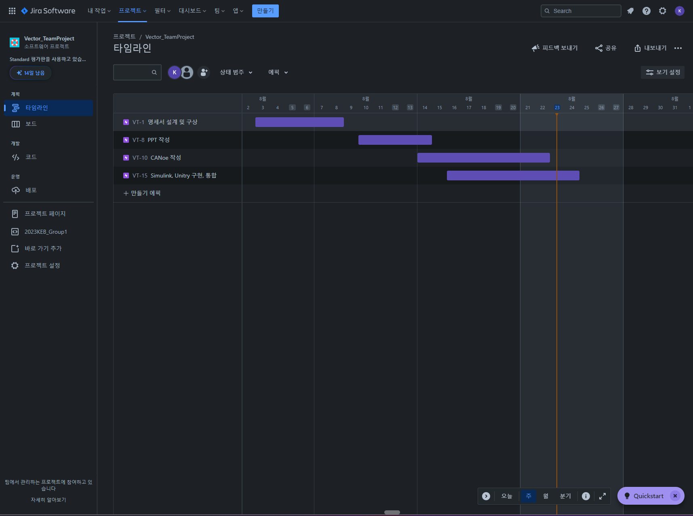
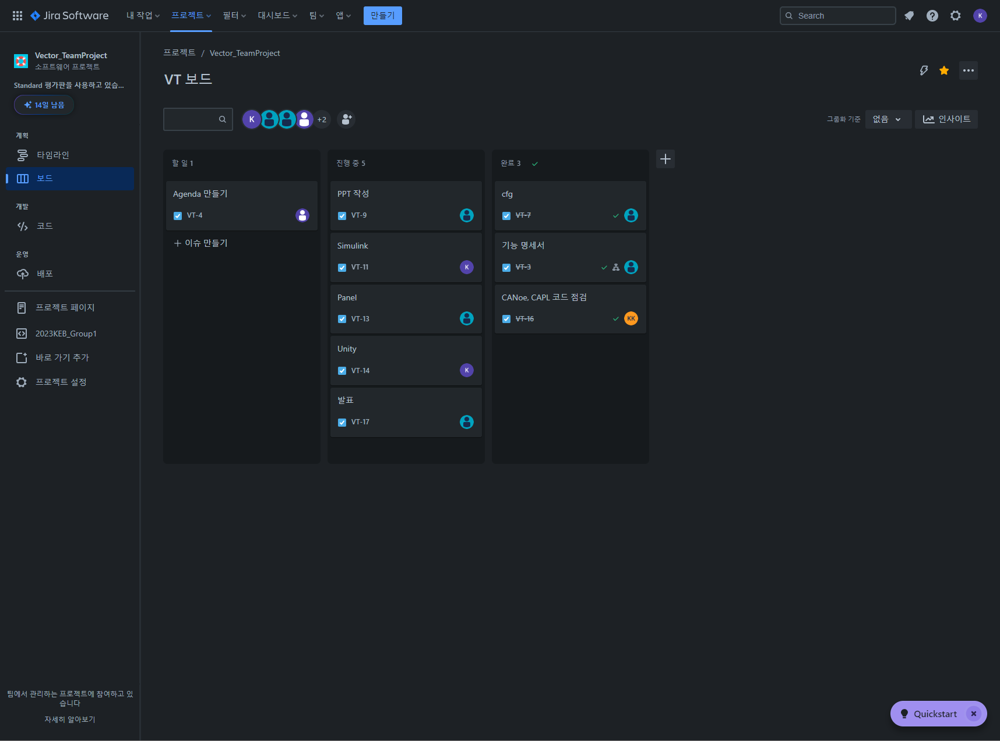

# 🚗2023KEB_Group1 VectorMen
<div align="center">
 
</div>

- 차량 제어 및 통신 통합 시험, 검증 시스템을 구현한 프로젝트입니다.
- 실제 차량에 적용되는 방식으로 차량 네트워크와 제어기들의 작동을 가상 환경에서 시험 및 검증할 수 있습니다.


## 🐕‍🦺 개 요
<div align="center">
 
</div>

- MBD기반 Simulink 제어 Model 구축 (PMSM모터, 에커만 스티어링 etc)
- CANoe를 통한 가상 제어기 구현 및 메시지, 시그널 설정 > 통신 시스템 검증 (1 Channel CAN Protocol)
- Unity를 이용한 차량 시뮬레이션 환경 제공


## 📦 구조도
- CANoe Vector I/O 라이브러리를 통해 MATLAB/Simulink와 데이터 송수신
- Unity, MATLAB/Simulink UDP Socket을 통해 송수신 [127.0.0.1:25000]

<div align="center">
 
</div>


## ⏲️ 개발 기간
- 23.07.24일 - 23.08.23일
<div align="center">
 
</div>


## 👪 멤버 구성
- 🛡️ 시험, 검증팀 : 하동훈, 조병민, 김상협
- ⚙️ 제어, 설계팀 : 김태영, 김기현, 방상우

## 🌊 개발 환경

### 1. 사용 언어
- C++, C#, CAPL

### 2. 작업 툴
- CANoe, MATLAB/Simulink, Unity, Blender

### 3. IDE
- Visual Studio 2022

### 4. 협업 툴
- Jira, Git, Github, Notion

## 📁 폴더 구조
```
📦Project
 ┣ 📂CAPL - 가상 시나리오 생성 CAPL 코드
 ┃ ┣ 📜SimulatorON.can
 ┃ ┣ 📜Sim_Test.can
 ┃ ┗ 📜Sim_Test.cbf
 ┣ 📂Database - 메시지, 시그널 정의 dbc파일
 ┃ ┗ 📜MBD.dbc
 ┣ 📂Exec32 - 32Bit dll, Simulink to CANoe build image, ini etc
 ┣ 📂Exec64 - 64Bit dll etc
 ┣ 📂Images - Image for readme
 ┣ 📂Model - MATLAB / Simulink Model
 ┃ ┣ 📜Main.slx
 ┃ ┗ 📜PMSM_Motor.slx
 ┣ 📂Panel - CANoe Panel, Image
 ┃ ┣ 📂Bitmaps
 ┃ ┣ 📜controlPanel.xvp...
 ┣ 📂VectorKEB_Unity - Unity Simulation.exe, dll + etc
 ┣ 📜MBD_Test.cfg - CANoe cfg 파일, 설정 저장
 ┣ 📜MBD_Test.stcfg
 ┣ 📜ProjectSettings.vtesettings
 ┗ 📜기능 명세서.xlsx - 기능 명세서
```

## 🚥 Process
<div align="center">
 
</div>
 
## 🚀 링크
### Unity
<https://github.com/WinterRat/Simulink_Unity_Car>

### Jira
<https://kebvector.atlassian.net/jira/software/projects/VT/boards/1/timeline>
<div align="center">
 
</div>
<div align="center">
 
</div>


## Acknowledgement
```
“본 연구는 과학기술정보통신부 및 정보통신기획평가원의 SW전문인재양성사업의 연구결과로 수행되었음“(2022-0-01127)

```
